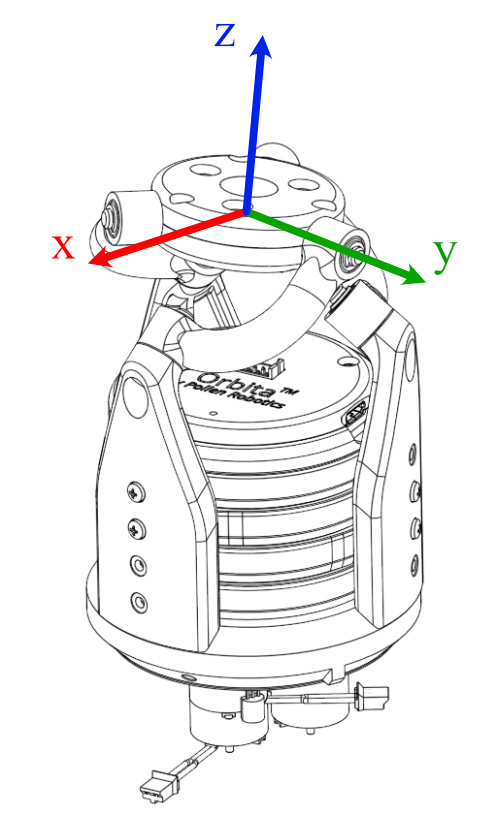

.. Orbita SDK documentation master file, created by
   sphinx-quickstart on Tue Mar  1 15:49:52 2022.
   You can adapt this file completely to your liking, but it should at least
   contain the root `toctree` directive.

Orbita's docs
=============

Table of Contents
-----------------

.. toctree:: 
   :maxdepth: 1

   control
   wiring
   safety
   zero
   sdk
   notebooks
   api

Introduction
------------

Orbita is a 3D parallel joint designed by `Pollen-Robotics <https://pollen-robotics.com>`_.

This actuator was developped to:

- provide **full control of the plate** at the top - 3D rotation on a same point,
- and combine the torque of the **three motors used in parallel** for efficiency.

The Orbita actuator embeds an electronic board that controls the three motors via a PID controller and gives access to temperature and extra information through RS485 communication. 

It requires a 12V power supply.

This documentation will guide you in :ref:`HowToControl` using our :ref:`PythonSDK`. This will allow you to simply start make Orbita move. 
