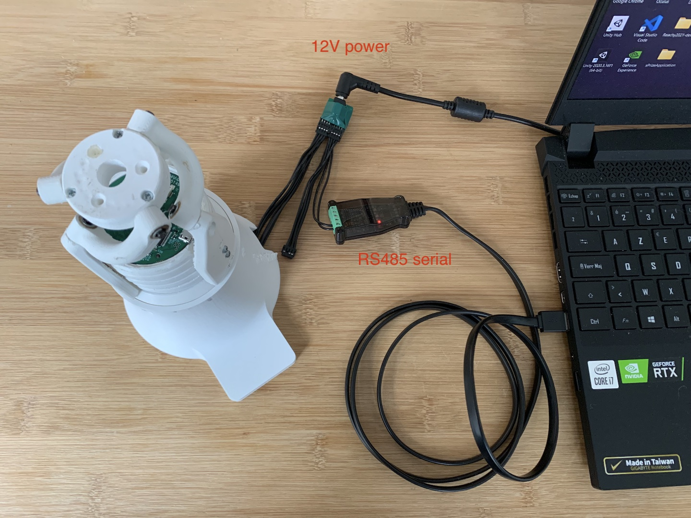

Wiring configuration
====================

In its demo version, Orbita needs to be connected to: 

- its 12V power supply
- a RS485 serial adapter connected to a PC via USB.

.. note:: When powering Orbita, you should see a blue LED turn on briefly.

.. warning:: The Micro-USB port is used to flash the firmware and will prevent Orbita from starting if connected.

