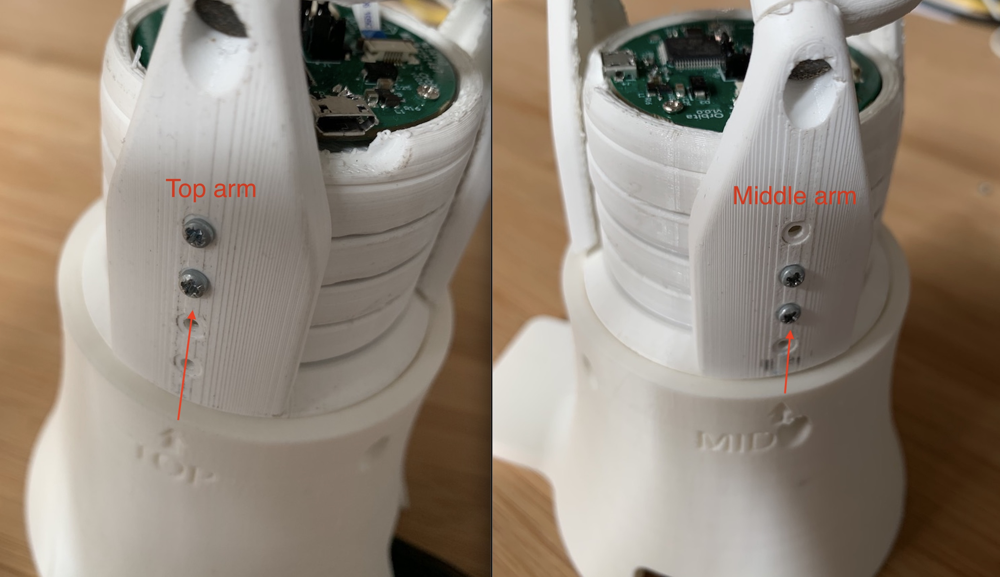
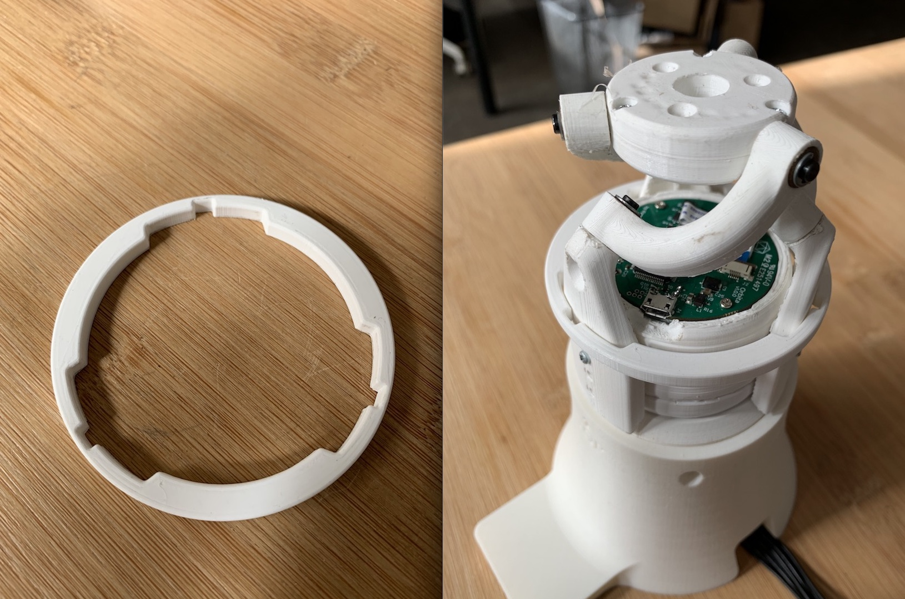

Zero
----

In this version of Orbita, **zero calibration is required at each startup.** This limitation comes from the fact that in this version, we do not have absolute position on the full 360° circle as Orbita's encoder are positionned before the reduction.

**The zero is defined by the position of Orbita when it starts up.**

To ensure a good zero, the base shows 3 arrows, one for each Orbita's arm (top, middle and bottom). You need to align the arm with each of this arrow.

.. note:: You can regognize each arm by where the screws are located (top for the top arm, in the middle for the mid arm, etc).

To ensure a better alignment and respect the intra arm distance, we also provide a 3D piece to fix the position. Do not forget to remove this piece before actually trying to make Orbita move!

.. warning:: The zero is defined when Orbita is turned on. This means when plugged in to its power supply. If you want to re-define it, you need to unplug, put Orbita in its zero position and re-plug it.

.. note:: This calibration procedure will not be necessary in Orbita next versions.