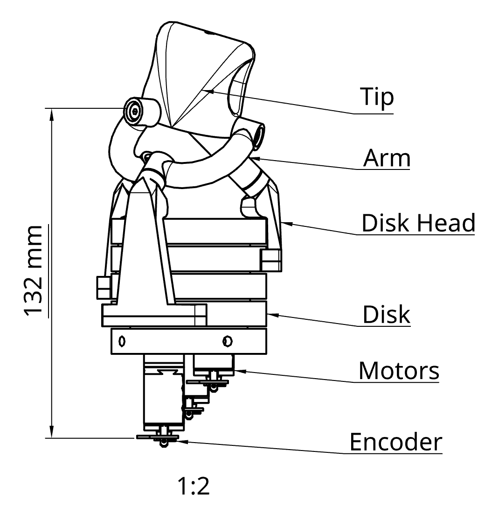

# Orbita python module



To control this actuator, a vector must be used to represent the orientation of the platform.
An angle must also be identified to know the rotation of the platform on its own Z axis.

The orbita library allows the user to chose the orientation of the platform by typing a vector and an angle
and to get the angles of the disks needed to do this rotation of the platform.

It also allows the user to use a quaternion (which can be provided by another system) to represent the rotation of the platform
and get the angles of the disks.

## Installation

Use the package manager [pip](https://pip.pypa.io/en/stable/) to install the orbita library.
```bash
pip install orbita
```

## Usage

```python
from orbita import *
a = Actuator([0,0,85],[0,0,65],35) #Creates the actuator object
a.get_new_frame_from_vector(vector,angle) #returns new X,Y,Z vectors coordinates
a.get_angles_from_vector(vector,angle) #returns q11,q12 and q13 angles values
a.get_new_frame_from_quaternion(quaternion) #returns new X,Y,Z vectors coordinates
a.get_angles_from_quaternion(quaternion) #returns q11,q12 and q13 angles values
```
The last method needs the last angular position of the disks and an offset of 360°.
These values need to be reset everytime the user reset the position of the disks.
```python
a.reset_last_angles()
a.reset_offset()
```
